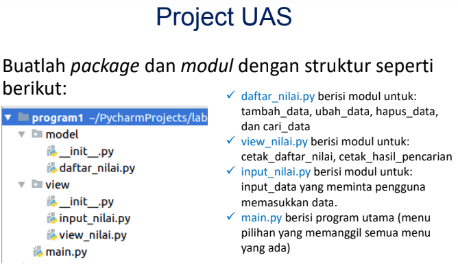

# Project UAS Semester 1

Nama : Ali Purnama alam</br>
NIM : 312210589</br>
Kelas: TI.22.B.2</br>

## Ketentuan Perogram

</br>

## Penjeleasan Program

Untuk membuat Program tersebut pertama buat package yang berisi file seperti dalam ketentuan di atas.</br>
-Pertama saya membuat file daftar_nilai.py yang terletak pada folder model dan berisi beberapa fungsi yaitu tambah_data, ubah_data, hapus_data, dan cari_data
dan berisi database berupa dictionary</br>
Berikut Code Program daftar_nilai.py

```py

database = {}

def tambah_data(nama,nim,tugas,uts,uas,akhir):
    database[nama] = nama, nim, tugas, uts, uas, akhir


def hapus_data(nama):
        if nama in database.keys():
            del database[nama]
            return True
        else:
            print(f'Data Dengan Nama {nama} Tidak Ditemukan!')
            return False
def ubah_data(nama):
    if nama in database.keys():
        del database[nama]

def cari_data():
    from view.view_nilai import cari
    cari(input("\nMasukan Nama Yang Ingin dicari = "))
```
