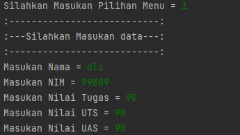
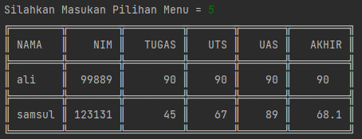
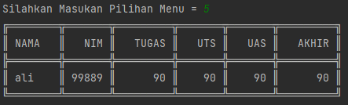
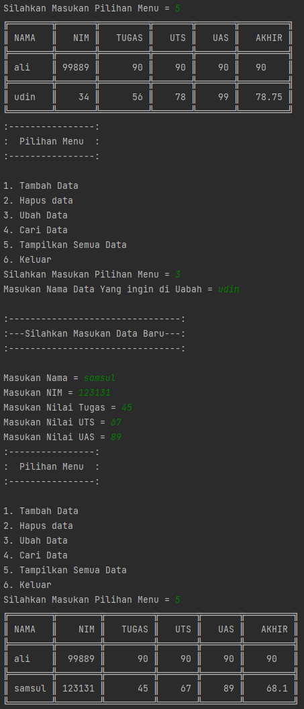
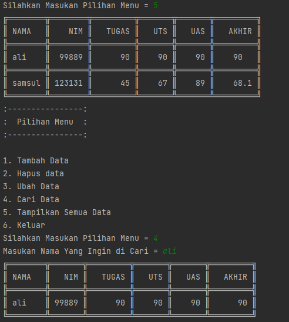
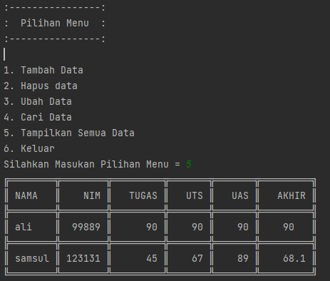

# Project UAS Semester 1

Nama : Ali Purnama alam</br>
NIM : 312210589</br>
Kelas: TI.22.B.2</br>

## Link Youtube Tutorial Program

https://youtu.be/_ttvS5ad1r4

## PDF Tutorial Program


## Ketentuan Perogram

</br>

## Penjeleasan Program

Untuk membuat Program tersebut pertama buat package yang berisi file seperti dalam ketentuan di atas.</br>

### daftar_nilai.py

- Pertama saya membuat file daftar_nilai.py yang terletak pada folder model dan berisi beberapa fungsi yaitu tambah_data, ubah_data, hapus_data, dan cari_data
  dan berisi database berupa dictionary</br>

  Berikut Code Program `daftar_nilai.py`

```py

database = {}

def tambah_data(nama,nim,tugas,uts,uas,akhir):
    database[nama] = nama, nim, tugas, uts, uas, akhir


def hapus_data(nama):
        if nama in database.keys():
            del database[nama]
            return True
        else:
            print(f'Data Dengan Nama {nama} Tidak Ditemukan!')
            return False
def ubah_data(nama):
    if nama in database.keys():
        del database[nama]

def cari_data():
    from view.view_nilai import cari
    cari(input("\nMasukan Nama Yang Ingin dicari = "))
```

### input_nilai.py

- Selanjutnya saya membuat fungsi untuk meminta user memsaukan data / input yang berada pada file input_nilai.py yang berada pada modul view dan input user di gabung dengan fungsi yang sudah saya buat sebelumnya pada daftar_nilai.py untuk memasukan inputan user ke database(dictionary)</br>

Berikut Code Perogram yang berada pada `input_nilai.py`

```py
from model.daftar_nilai import tambah_data, ubah_data, hapus_data
from view.view_nilai import cari


def masukan_data():
    print("\n|=========================|")
    print("|  Tambah Data Mahasiswa  |")
    print("|=========================|")

    nama = input("\nMasukan Nama = ")
    nim = int(input("Masukan NIM = "))
    tugas = int(input("Masukan Nilai Tugas = "))
    uts = int(input("Masukan Nilai UTS = "))
    uas = int(input("Masukan Nilai UAS = "))
    akhir = float((0.30 * tugas) + (0.35 * uts) + (0.35 * uas))
    tambah_data(nama,nim,tugas,uts,uas,akhir)

def cari_hapus():
    hapus_data(input("Masukan Nama yang ingin di Hapus = "))

def cari_ubah():
    ubah_data(input("Masukan Nama dari Data yang ingin di Ubah = "))
    print("\n:=====================:")
    print(":  Masukan Data Baru  :")
    print(":=====================:")

    nama = input("\nMasukan Nama = ")
    nim = int(input("Masukan NIM = "))
    tugas = int(input("Masukan Nilai Tugas = "))
    uts = int(input("Masukan Nilai UTS = "))
    uas = int(input("Masukan Nilai UAS = "))
    akhir = float((0.30 * tugas) + (0.35 * uts) + (0.35 * uas))
    tambah_data(nama, nim, tugas, uts, uas, akhir)
```

### view_nilai.py

- Selanjutnya saya membuat fungsi untuk menampilkan semua data yang ada dan fungsi untuk menampilkan hasil pencarian user dengan menggunakan modul tabulate data untuk mempercantik tabel dan memanggil database(dictionary) yang ada pada modul `daftar_nilai.py` </br>

Berikut code program `view_nilai.py`

```py
from model.daftar_nilai import database
from tabulate import tabulate


def tampilkan():
    print(tabulate(database.values(), headers=[
          "Nama", "NIM", "Tugas", "UTS", "UAS", "AKHIR"], tablefmt="double_grid"))


def cari(nama):
    Data_cari = {}
    for key, value in database.items():
        if nama in value:
            Data_cari[key] = value

    print(tabulate(Data_cari.values(), headers=[
          "Nama", "NIM", "Tugas", "UTS", "UAS", "AKHIR"], tablefmt="double_grid"))
```

### main.py

- Terakhir saya membuat file main.py yang berisi code program untuk menyatukan semua fungsi yang ada di beberapa modul yang telah saya buat sebelumnya dengan mengimport modul dan fungsi yang akan saya pakai ke dalam main.py dan saya membuat perulanagn menggunakan `py while True: ` untuk mebuat perulangan pada pilihan menu yang akan tampil sebagai pilihan user.</br>

Berikut Code program `main.py`

```py
import model
import view
import os


while True:
    print('\n|================|')
    print('|  Pilihan Menu  |')
    print('|================|')
    print('\n1. Tambah Data')
    print('2. Hapus Data')
    print('3. Ubah Data')
    print('4. Cari Data')
    print('5. Lihat Semua Data')
    print('6. Keluar ')

    pilihan = input('\nMasukan Pilihan Menu = ')

    if pilihan == '1':
        view.input_nilai.masukan_data()
    elif pilihan == '2':
        view.input_nilai.cari_hapus()
    elif pilihan == '3':
        view.input_nilai.cari_ubah()
    elif pilihan == '4':
        model.daftar_nilai.cari_data()
    elif pilihan == '5':
        view.view_nilai.tampilkan()
    elif pilihan == '6':
        break
    else:
        print('Masukan Pilihan yang Benar!!')

```

## Hasil Perogram

### Tambah Data

- Berikut dokumentasi untuk hasil program tambah data</br>
  </br>

### Hapus Data

- Berikut dokumentasi untuk hasil program hapus data</br>
  sebelum di hapus</br>
  </br>
  proses hapus data</br>
  </br>
  seletah di hapus</br>
  </br>

### Ubah Data

- Berikut dokumentasi untuk hasil program ubah data</br>
  </br>

### Cari Data

- Berikut dokumentasi untuk hasil program cari data</br>
  </br>

### Tampilkan Semua Data

- Berikut dokumentasi untuk hasil program tampilkan semua data</br>
  </br>

# Sekian Progam kali ini Terima kasih 💋
